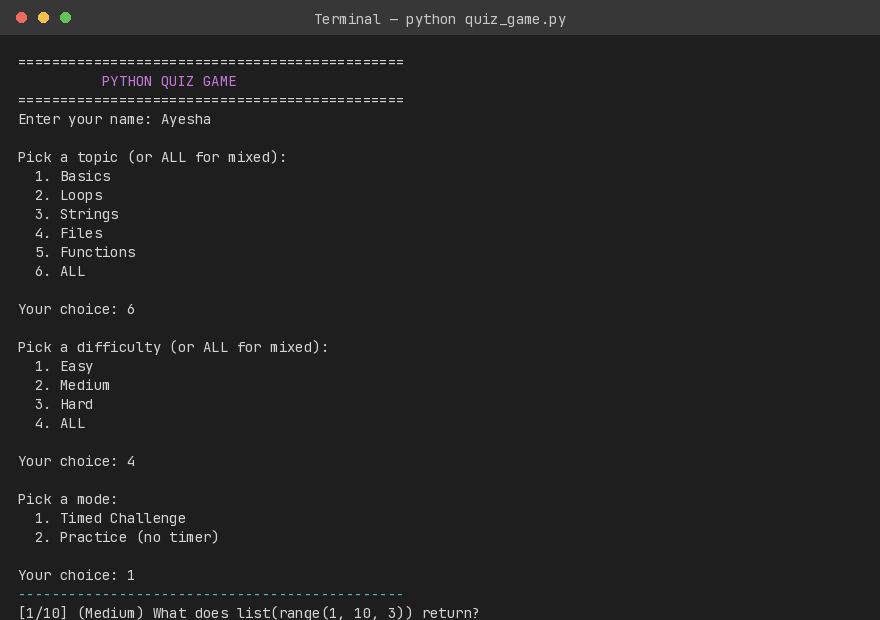
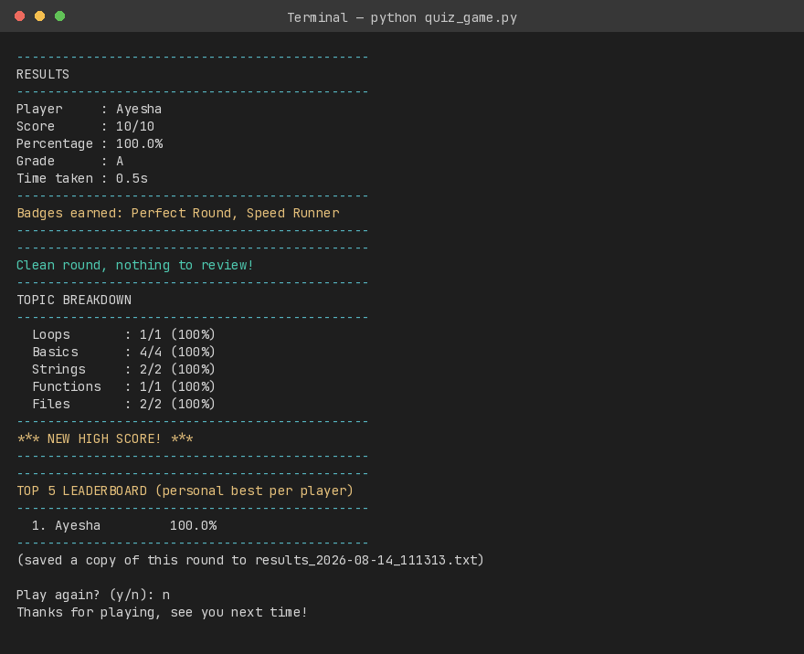

# Python Quiz Game

**CloudExify Python Internship 2026 — Month 2, Project 3**

- **Name:** [Alisha Munir]
- **Reg no:**[CX-INT-2026-PY-0214]
- **Type:** Command Line Interface (CLI) Application
- **Language:** Python 3.x

---

## 1. Project Overview

A command-line Python quiz game that lets a user pick a topic, a difficulty level, and a game mode, then answer multiple choice questions pulled from a 49-question bank. The game shuffles both the question order and the answer choices every round, tracks the player's score and grade, reviews wrong answers, breaks down performance by topic, and maintains a persistent leaderboard of personal-best scores across sessions.

---

## 2. Core Features

| Feature | Description |
|---|---|
| Question Bank | 49 questions across 5 topics (Basics, Loops, Strings, Files, Functions), each tagged with a difficulty (Easy/Medium/Hard) |
| Randomized Rounds | `random.sample()` picks a fresh, non-repeating set of questions each round; `random.shuffle()` reorders the answer choices |
| Topic Selection | Play a single topic or ALL for a mixed round |
| Difficulty Selection | Play a single difficulty or ALL for a mixed round |
| Game Modes | Timed Challenge (25s per question) or Practice (no timer) |
| Scoring | Correct count, percentage, and letter grade (A–F) shown at the end |
| Answer Validation | Only A/B/C/D accepted; anything else is rejected and re-asked |
| Save to File | Leaderboard auto-saved to `leaderboard.txt` after every round |
| Load from File | Leaderboard auto-loaded on startup |

## 3. Bonus Features Implemented

| Bonus | Description |
|---|---|
| Name Validation | Player name must be non-empty, letters only, under 20 characters |
| Answer Review Screen | Lists every question missed, the player's answer, and the correct one |
| Topic Breakdown | Accuracy per topic, with the weakest topic flagged (only when meaningful) |
| Achievement Badges | Perfect Round, Speed Runner, Comeback Kid, based on performance patterns |
| Personal-Best Leaderboard | Keeps each player's best score only — a worse replay never overwrites a better one |
| Top-5 Leaderboard Trim | Leaderboard file keeps only the 5 highest scores overall |
| Colored Terminal Output | Green for correct, red for wrong, yellow for highlights, via `colorama` |
| Per-Round Results Export | Every round is saved as its own timestamped `.txt` file with a full question log |


---

## 4. Data Structure

```python
question = (
    "Loops",                                  # topic
    "Medium",                                 # difficulty
    "i=0; while i<3: print(i); i+=1  -->  what prints?",  # question text
    ["0 1 2", "1 2 3", "0 1 2 3", "Infinite loop"],        # choices
    "0 1 2"                                    # correct answer (stored as text, not a letter)
)

history_entry = {
    "topic": "Loops",
    "question": "i=0; while i<3: print(i); i+=1  -->  what prints?",
    "picked": "0 1 2",
    "correct": "0 1 2",
    "was_correct": True
}
```

---

## 5. Functions

| Function | Purpose |
|---|---|
| `QuizEngine.build_round(topic, difficulty)` | Filters the question bank by topic/difficulty and samples a random, non-repeating round |
| `QuizEngine.ask(index, total, question)` | Displays a question, shuffles its choices, times the answer, and logs the attempt |
| `calc_grade(percent)` | Converts a percentage into a letter grade (A–F) |
| `ask_player_name()` | Repeatedly prompts until a valid player name is entered |
| `choose_from_menu(prompt, options)` | Generic numbered menu picker, reused for topic/difficulty/mode selection |
| `load_leaderboard()` | Reads `leaderboard.txt` into a `{name: best_percent}` dictionary |
| `save_score(name, percent)` | Single source of truth for whether a run is a new personal best; saves and trims the leaderboard to the top 5 |
| `print_leaderboard(entries)` | Displays the top 5 leaderboard |
| `print_review(history)` | Displays every question the player got wrong |
| `print_topic_breakdown(history)` | Displays per-topic accuracy and the weakest topic |
| `get_badges(history, seconds_taken)` | Determines which achievement badges were earned this round |
| `save_results_file(...)` | Writes a full question-by-question log of the round to a timestamped `.txt` file |
| `play_round(engine)` | Runs one full round: menus, questions, scoring, review, leaderboard |
| `main()` | Play-again loop and program entry point |

---

## 6. Design Decisions

- **Correct answer stored as text, not a fixed letter (A/B/C/D)** — this allows the answer choices to be shuffled every round without ever breaking the answer-checking logic, since the check compares text to text rather than relying on a position that changes.
- **`save_score()` as the single source of truth for "new high score"** — earlier in development, the "is this a new personal best?" check was done in two separate places (once manually in `play_round()`, once again inside the save function), which meant the two checks could disagree if one was ever changed without the other. This was consolidated into one function that both decides and saves, and `play_round()` just uses its return value.
- **Streak bonus points were removed from the final scoring** — an earlier version added bonus points to the score for consecutive correct answers, but this made the displayed "Total points" inconsistent with the actual `correct/total` ratio used for the grade. Since the assignment's grading is based on a plain percentage, the bonus was removed to keep the score, percentage, and grade fully consistent with each other.
- **No emoji in terminal output** — an earlier version printed an emoji next to the "new high score" message. This was removed because Windows terminals using the default `cp1252` console encoding can raise a `UnicodeEncodeError` on emoji, which would crash the game for some users.
- **Dictionaries and tuples over classes for question data** — the question bank uses plain tuples rather than a custom class, which keeps the data easy to read and edit directly (important since new questions were added several times during development) at the cost of needing to unpack fields by position rather than by name.

---

## 7. Sample Output

```
==============================================
RESULTS
----------------------------------------------
Player     : Ayesha
Score      : 10/10
Percentage : 100.0%
Grade      : A
Time taken : 42.3s
----------------------------------------------
Badges earned: Perfect Round, Speed Runner
----------------------------------------------
TOP 5 LEADERBOARD (personal best per player)
----------------------------------------------
  1. Ayesha         100.0%
----------------------------------------------
```

### Screenshots

**Menu & Gameplay**


**Final Results**


---

## 8. Testing

| # | Test Case | Steps | Expected Result | Actual Result | Status |
|---|-----------|-------|------------------|----------------|--------|
| 1 | Run game — 10 questions shown | Start a round with topic=ALL, difficulty=ALL | Questions shown in random order | Displayed 10 questions, order confirmed random | ✅ Pass |
| 2 | Run again — different order | Run `build_round()` twice with different random seeds | Questions shuffled differently on second run | Confirmed two different orders | ✅ Pass |
| 3 | Enter wrong letter (e.g. E) | Type "E" at a question prompt | Error message, ask again | Showed "not one of the options", re-asked | ✅ Pass |
| 4 | Answer all correctly | Answer every question correctly in a round | Score 10/10, Grade A | Score 10/10, Percentage 100.0%, Grade A | ✅ Pass |
| 5 | Answer all wrong | Answer every question incorrectly in a round | Score 0/N, Grade F | Score 0/5, Percentage 0.0%, Grade F | ✅ Pass |
| 6 | Beat previous high score | Save a 40% run, then a 70% run for the same player | New high score message | Second run triggered "NEW HIGH SCORE" message | ✅ Pass |
| 7 | Play again after finishing | Answer "y" at the play-again prompt | New game starts fresh | History reset, new question set sampled | ✅ Pass |
| 8 | Choose not to play again | Answer "n" at the play-again prompt | Goodbye message, exits | Printed goodbye message, exited cleanly | ✅ Pass |
| 9 | Enter a blank name | Press Enter with no input at the name prompt | Rejected, asks again | Showed "Name can't be blank.", re-asked | ✅ Pass |
| 10 | Enter a numeric name | Enter "123" at the name prompt | Rejected, asks again | Showed "letters only" message, re-asked | ✅ Pass |
| 11 | Leaderboard keeps personal best only | Save 50%, then 80%, then 30% for the same player | Final saved score stays at the highest (80%) | Confirmed final value was 80.0 | ✅ Pass |
| 12 | Leaderboard keeps top 5 only | Save scores for 7 different players | Only the top 5 remain in the file | Confirmed lowest 2 were dropped | ✅ Pass |
| 13 | Question bank sanity check | Check every question's correct answer against its own choices list | Every answer matches one of its choices | No mismatches found across all 49 questions | ✅ Pass |
| 14 | Topic breakdown on a perfect round | Complete a round scoring 100% across all topics | No misleading "weakest topic" tip shown | Confirmed tip only appears when a topic scores below 100% | ✅ Pass |
| 15 | Automated test suite | Run `pytest test_quiz.py -v` | All unit tests pass | 10 passed, 0 failed | ✅ Pass |

---

## 9. Bugs Found During Development & Resolutions

| Bug | Description | Resolution |
|---|---|---|
| Attribute name mismatch | `__init__` stored `self.question_per_round` (singular) but `build_round()` read `self.questions_per_round` (plural), causing an `AttributeError` on the very first run | Renamed both to match exactly |
| Topic filter case mismatch | `build_round()` checked `topic == "All"` but the menu function actually returned `"ALL"` (all caps), so the mixed-round option silently never triggered | Corrected the string to `"ALL"` in both places |
| No name validation | Early version accepted any input as a player name, including blank input or pure numbers (e.g. "1") | Added `ask_player_name()` with checks for blank, non-letters, and max length |
| Duplicate "new high score" logic | The check for whether a run was a new personal best was done manually in `play_round()` and separately, again, inside the save function — two places that could disagree | Consolidated into a single `save_score()` function that returns whether it was a new high score |
| Misleading "weakest topic" tip | On a perfect (100%) round, the topic breakdown still picked one topic as "weakest" even though every topic scored equally | Tip now only prints when the weakest topic actually scored below 100% |
| Emoji crash risk on Windows | An earlier version printed an emoji in the "new high score" message, which can raise `UnicodeEncodeError` on a Windows console using the default `cp1252` encoding | Replaced the emoji with plain ASCII text (`*** NEW HIGH SCORE! ***`) |
| Inconsistent scoring display | An earlier version added streak bonus points to a separate "Total points" line that didn't match the percentage/grade shown right below it | Removed the bonus points entirely so score, percentage, and grade are always consistent with each other |

---

## 10. How to Run

```bash
pip install -r requirements.txt
python quiz_game.py
```

Leaderboard data is saved to and loaded from `leaderboard.txt`. Each round's full question-by-question log is also exported as `results_<timestamp>.txt`.

### Running the tests
```bash
python -m pytest test_quiz.py -v
```
